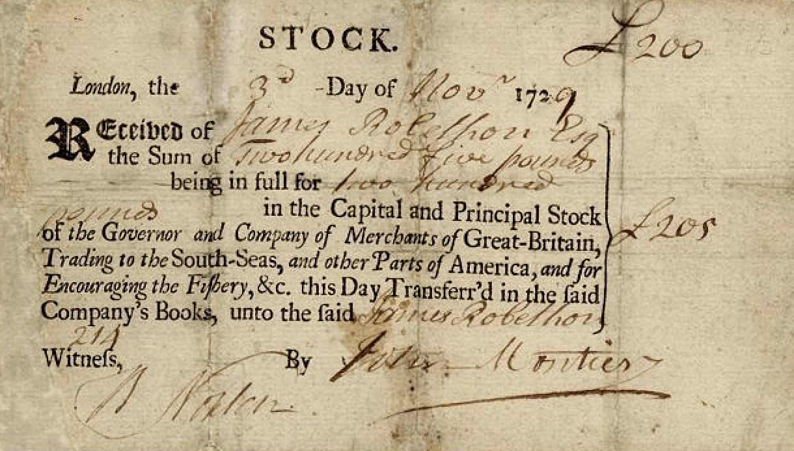
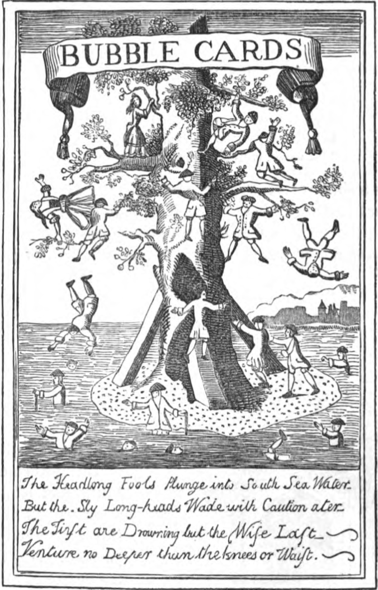

A collaborative project for Hist 1067: A History of Economic Thought. Source: BA. “A Letter to Sir John Eyles, Bart. Sub-governor of the South Sea Company,” London, 1722.s

### Introduction

In the aftermath of the War of Spanish Succession (1701-1714), Great Britain was an empire on the rise thanks to its successful war-time endeavors. The state’s military success was arguably the result of its uncanny ability to finance wars. As Britain basked in financial and military success, the underlying stability of its financial system loomed large. Government officials searched for financial innovations to relieve the burden of Britain’s debt. They sought to transfer the government’s debt to private institutions like the Bank of England and the South Sea Company who put forth competitive offers to finance the country’s debt. Implicit in the stock issue was an ingrained perception that rising prices would lift the fortunes of both the company and the national treasury. Only a few officials in the Bank of England warned of the unsustainable speculation, hinting at the eventual crash. In the aftermath of the collapse of the South Sea stock, men of considerable public credit and stature, like Sir John Eyles of the East India Company, were brought to restore equilibrium. To combat a dire financial situation, a well-intentioned man like Sir John Eyles found himself engaging in deceitful practices and questionable means. As exemplified by “A Letter to Sir John Eyles,” the complex if incoherent response to the crash underscored how cunning tactics and a lack of transparency—traits that led to the crisis—were central to achieving financial stability in 18th century financial systems.

In the midst of the financial revolution of the 18th century, “London was possessed by an urge to make money.” That is, people began to substitute away from land and into shares and bonds. Stocks promised a convenient way to secure and grow an investment so much so that speculation often came hand in hand with the creation of these companies. Founded in 1711, the South Sea Company took advantage of shifting economic trends and capitalized on the public’s desire to invest. Not only were the wealthy investing in stocks, but also a wider share of the public who now had more access to financial information through newspapers. News was no longer the commodity of the wealthy and well connected. By 1695, Londoners had an option of at least five different tri-weekly newspapers. A proliferation of financial news created an appetite for information and stocks. Rags to riches stories together with belief of inexhaustible riches in the Spanish colonies, which the South Sea Company held a monopoly on, fueled a frenzy to purchase shares of the joint-stock company.

 This sentiment was exacerbated in 1720 when the British government handed over a larger proportion of its debt, reinforcing the idea that the South Sea company was bound to succeed. Looking to reduce the financial burden accumulated during a series of wars in the 17th century, the British Treasury allowed holders of its debt to exchange government securities for an equivalent sum in shares of the South Sea company. Central to this scheme was the belief that prices of the stock would increase, leaving the British Treasury with less debt and its creditors content with a valuable asset. The allure of making a considerable sum of money infected all facets of society. Rumor and innuendo on Exchange Street, where stocks traded, dominated public conversation. Not surprisingly, news of the new scheme increased speculation and sent the stock soaring from £300 in April, 1720 to £1,000 by August, 1720. Historian Charles MacKay aptly captures the atmosphere: “The speculating frenzy had seized them as well as the plebeians...It seemed at that time if the whole nation had turned stock-jobbers. Everybody came to purchase stock.” Implicit in the bidding up of the stock was a hysteria driven by greed and desire to make money. Not only was this craze driven by public action, but also by the directors of the company who kept issuing stock and promising the stability of the company when it was teetering on collapse. A crash was looming in the horizon.

### The Crisis, Sir John Eyles, and the Response:

In January of 1720, the price of the South Sea Company stock dropped from £1,000 to £100. Many lost everything: the consequences were devastating for institutions and individuals alike. In response, Parliament launched a formal investigation of the matter. The role of every director was examined and many were stripped of large proportions of their wealth. Some were even arrested. Parliament appointed a set of new directors, which included Sir John Eyles, who was formerly a director of the Bank of England and East India Company. Many English were rightfully angry at the rampant speculation and fraudulent behavior of the directors.

The anger is evident in “A Letter to Sir John Eyles, Bart. Sub Governor of the South Sea Company” signed anonymously, AB, and circulated in January of 1722. AB’s letter was written in conversation with another pamphlet titled, “A Letter to Sir John Eyles, from Gentlemen at Windsor” that criticizes and questions Eyle’s integrity. Though the identity of AB is unknown, he seems familiar with the work and dealings of Eyles and the South Sea Company enough to defend him. AB regards himself as a “sufferer of this unhappy Company,” implying that he must  be investor or employee of the South Sea Company. AB appears to be loyal to Eyles and wants to counter the claims against Eyles. Though addressed to Eyles, the letter is not personal correspondence, which would have been handwritten and would not have included a cover page and docket-title. The letter is meant for public circulation and part of a larger debate regarding the crisis, its causes, who is to blame, and how to remedy it. The appearance of this debate in the public is remarkable and indicative of an increasing public accountability for financial mismanagement. Put simply, the public was now playing a larger role in holding companies responsible for their mismanagement.
### A Tenuous Financial System: Perception and Deceit:

The historical context of Sir John Eyles’ tenure reveals that the sub-governor of the South Sea Company was indeed determined to improve the company’s situation and hence was a man of honest intentions. A close reading of the source suggest that he was perceived in this way by certain factions of investors as well. Over his tenure, Eyles prevented the complete collapse of the South Sea Company, overcoming “formidable” challenges. Agreements such as the ‘Bank Treaty’ of 1722 “restored the badly-shaken South Sea Company to equilibrium” and allowed for the company to repay great portions of its debts over the following decade. Eyles’ ‘success’ demonstrates that he was indeed committed to ameliorating the financial condition of the company and not just waiting his turn to take advantage of tired proprietors. While not universally, Sir Eyles was respected for his honest aims by a portion of the investor body. In the first two pages of the pamphlet, A.B. outlines Sir Eyles’ track record as a politician and director of the Bank of England, where he “distinguished … [him]self with Integrity, Impartiality and Dispatch.” He argues that his success as a member of Parliament is a clear testament to his honesty in all of his activities - after all, the actions of a politician, unlike that of a director of a joint-stock company, are continuously under the scrutiny of men “that will not be cajoled”. The author cites the manner in which Sir Eyles repaid his loan from the South Sea Company with full interest as “Proof to [his] Honesty.” He provides proof of his commitment to the proprietors through his much contested schemes with the Bank of the England, which according to A.B. resulted in “great Comfort and Consolation” for the South Sea Company’s investors. The picture that the author paints of Sir Eyles is one of allegiance to the cause of stabilizing the company. He is a man of noble ends - his means, on the other hand, cannot be always characterized as such and will be the subject of discussion later. Clearly, A.B. is writing with the purpose of defending Sir Eyles. Yet, his opinion should not be discarded and discounted as biased given that the examples he presents are factually correct. Furthermore, the fact that certain groups believed in Sir Eyles with enough dedication to distribute these kinds of pamphlets at a time when it is reported that the proprietors were for the most part “sullen and resentful” against the new directors, is all the more a testament to his perceived integrity being grounded in reality. It should not be excluded that this pamphlet could have been created by Sir Eyles himself or someone working for him given its anonymous nature; these considerations lead us to question the extent to which the sub governor balanced noble intentions with cunning means.

Although perhaps truly faithful to his duty, Sir John Eyles did not shy away from using deceitful tactics to pursue his goals. According to A.B.’s account, Eyles had to “bamboozle the Ministry” and respond to the Bank’s obfuscation by “depreciating [his] own Stock, magnifying the Company’s Losses, and concealing [his] Advantages.” Having previously established that Sir Eyles was a man of integrity, there now seems to be an inconsistency in his behavior. It seems reasonable to assume that he would not act dishonestly unless it were a necessity, which pushes us to deduce that the greater environment in which he operated did not allow one to achieve his objectives without engaging in some form of deceitfulness. The fact that he is praised for his trickery on a publicly available pamphlet is further evidence that the issues lies in the context rather than in the sub-governor’s character. It appears to have become well accepted that, for example, the only way to counter the Bank of England’s artful measures and obtain favorable terms is to behave similarly dishonestly. “A Letter to Sir John Eyles, from Gentlemen at Windsor” reveals more of Sir Eyles’ cunning tactics. In order to gain approval for his strategy of selling part of the stock to the Bank of England, he once scheduled a General Court meeting with only a day’s notice and without publicizing it in the “publick Gazette”. Ironically, these are cited to be the same methods that his predecessors used, demonstrating that both well-intentioned and deceptive men had to proceed with questionable means to reach their goals. A lack of transparency appears to have been the law of the land rather than the tool of the wicked.

### Concluding Remarks

From this analysis, much is revealed about the greater context in which the source is situated. Sir John Eyles’ struggles indicate that he found himself in a financial system where even the those attempting to conduct sound business were forced to utilize deception to get their way. As mentioned previously, A.B.’s tone in describing the sub-governor’s artful means is not one of scorn, suggesting that these practices were the norm rather than the exception. At this point, a larger research scope would be required to identify precisely what made navigating this system so difficult to lead even the most noble of men to engage in deceit. We present three potential factors. First, the proprietors of many Bubbles such as the South Sea Company came from a fairly diverse set of intellectual, social and economic backgrounds. The frenzy affected a significant portion of society. Hence, part of the difficulty with leading these companies can be attributed to the wide range of opinions and clashing interests that arose from the heterogeneous mix of investors. Second, while directors such as Sir Eyles had many supporters, they were also enveloped by an aura of mistrust. The South Sea proprietors were at times described as “mutinous” and unwilling to comply with any of the sub-governor’s demands.  Therefore, it appears that an honest yet cunning man saved the day, raising the question of whether this is how crises should be solved.  

### Post Scriptum

Ironically, the 2008 financial crisis repeated many of themes evident in the South Sea crisis. Before 2008, only a few warned of deregulated derivative markets and cheap access to credit. Just as the British public in 1720 largely failed to see how prices in the South Sea company could fall, bankers and homeowners in 2007 failed to recognize the tenuous nature of mortgage backed securities. In both cases an ingrained belief and confidence that rising prices would save the day was mistaken. Pride goeth before destruction.

### Bibliography

“A Letter to Sir John Eyles, Bart. Sub-governor of the South Sea Company.” London:
1722.

“A Letter to Sir John Eyles, from Gentlemen at Windsor.” London: 1722.

Carswell, John. The South Sea Bubble. New Hampshire: Alan Sutton Publishing, 1993.

Dickson, P.G.M..The Financial Revolution in England: A Study in the Development
of Public Credit. New York: Macmillan, 1967.

Mackay, Charles. Memoirs of Extraordinary Popular Delusions and the Madness of the Crowds. London: Robson, Levey & Franklyn, 1852.

*All images from Mackay see above. 
